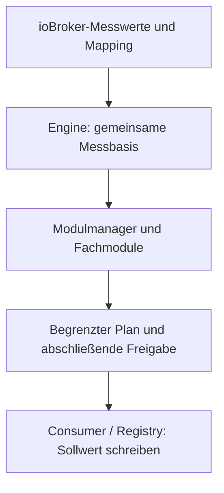
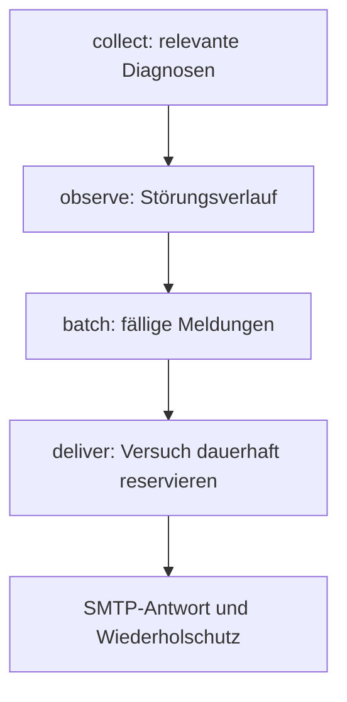

# NexoWatt EOS – den Quellcode nachvollziehen

Beginne bei dem fachlichen Ablauf, den du verstehen möchtest. Die Tabelle nennt
die Originalquelle; die gleichnamige JavaScript-Datei ist häufig ein Build-Ergebnis.
Die [Verknüpfungsübersicht](QUELLCODE_VERKNUEPFUNGEN_DE.md) führt danach zu den
Imports, ihren Gegenrichtungen und allen erfassten benannten Funktionen/Methoden.

## Die wichtigsten Einstiege

| Frage | Originalquelle | Verbindung |
| --- | --- | --- |
| Wie startet EOS und wo werden APIs registriert? | [Adapter-Kern](../src-ts/runtime-executables/main.ts) | ioBroker-Lebenszyklus, Webserver, Cache, EMS, Benachrichtigung |
| Wann läuft die Regelung? | [EMS-Engine](../src-ts/runtime-executables/ems/engine.ts) | periodische und schnelle Ticks, Messbasis, Modulmanager |
| In welcher Reihenfolge arbeiten Apps? | [Modulmanager](../src-ts/runtime-executables/ems/module-manager.ts) | Aktivierung, Reihenfolge, Fehlerisolation, Diagnose |
| Woher kommen Messwerte und wohin gehen Befehle? | [Datenpunkt-Registry](../src-ts/runtime-executables/ems/datapoints.ts) | Mapping, Einheiten, ioBroker-States, Schreibpfad |
| Warum bekommt ein Ladepunkt diese Leistung? | [Lademanagement](../src-ts/runtime-executables/ems/modules/charging-management.ts) | Bedarf, Modus, PV, Netz, Stationen, Ladeplan |
| Wo gelten Strom-/Leistungsgrenzen? | [Elektrische LP-Grenzen](../src-ts/runtime-executables/lib/evcs-electrical-limits.ts) | gemeinsame Prüfung für Einrichtung und Laufzeit |
| Wer schreibt die Wallbox? | [EVCS-Consumer](../src-ts/runtime-executables/ems/consumers/evcs.ts) | endgültige Freigaben und Sollwertübergabe an Registry |
| Warum lädt/entlädt ein Speicher? | [Speicherregelung](../src-ts/runtime-executables/ems/modules/storage-control.ts) | aktive Topologie, SOC, Netz, Tarif, Fahrzeugschutz |
| Wie wird der Netzanschluss geschützt? | [Core-Limits](../src-ts/runtime-executables/ems/modules/core-limits.ts), [Safety-Envelope](../src-ts/runtime-executables/ems/services/safety-envelope.ts) | gemeinsames Budget, Reservierungen, abschließende Freigabe |
| Wie kommen Daten ins Dashboard? | [Kunden-Dashboard](../src-ts/runtime-executables/www/app.ts) | Zustands-API und SSE des Adapter-Kerns |
| Wo speichert der Installer Zuordnungen? | [App-Center](../src-ts/runtime-executables/www/ems-apps.ts) | Konfigurations-APIs, Persistenz und anschließende Runtime |
| Wie richten Installer/Admin SmartHome ein? | [SmartHome-Konfiguration](../src-ts/runtime-executables/www/smarthome-config.ts) | Strikte Fachrolle, gemeinsamer SmartHome-Vertrag, Speichern/Laden |
| Wann wird eine Mail verschickt? | [Maildienst](../src-ts/runtime-executables/lib/notification-mail.ts), [Versand-Policy](../src-ts/runtime-executables/lib/notification-policy.ts) | Ereignisse → Auswahl/Wiederholschutz → TLS-SMTP |

## Messwert → Regelentscheidung → Hardware

Die Pfeile erklären den fachlichen Ablauf; die genaue Implementierung ist über
mehrere Helfer verteilt. Eine Anzeige oder ein berechneter Plan ist noch kein
bestätigter Hardwarebefehl. Ob eine Station einen Befehl angenommen hat, wird
gesondert über Status-/Bestätigungswerte bewertet.

Der NVP ist der Netzverknüpfungspunkt. In der zentralen signierten Messbasis
bedeutet positiver Wert Bezug, negativer Wert Einspeisung. Herstellerdaten können
anders vorzeichenbehaftet sein; dafür gibt es Mapping und Umrechnung. Null ist
ein gültiger Wert. Fehlend, veraltet und null sind drei unterschiedliche Fälle.

## AC/DC-Laden genauer lesen

1. Das App-Center speichert Ladepunkt-/Stationszuordnung, Steuerpfad und
   elektrische Mindest-/Maximalgrenzen. [evcs-electrical-limits](../src-ts/runtime-executables/lib/evcs-electrical-limits.ts)
   prüft den gemeinsamen Vertrag.
2. Das [Lademanagement](../src-ts/runtime-executables/ems/modules/charging-management.ts)
   verbindet Fahrzeugbedarf, Benutzerfreigaben, Lademodus, Zielzeit, PV und Netzbudget.
3. Die typisierten Helfer für [Verteilung](../src-ts/ems/charging-management/charging-allocation.ts)
   und [Phasenwahl](../src-ts/ems/charging-management/charging-phase-selection.ts)
   liefern begrenzte Entscheidungen. Stationsgrenzen betreffen die Summe der
   zugeordneten Ladepunkte, Ladepunktgrenzen den einzelnen Anschluss.
4. Der [Schreibplan](../src-ts/ems/charging-management/charging-write-plan.ts)
   beschreibt vorgesehene Schreibwerte. [EVCS-Consumer](../src-ts/runtime-executables/ems/consumers/evcs.ts)
   und [Registry](../src-ts/runtime-executables/ems/datapoints.ts) verbinden sie
   mit der Sicherheitsfreigabe und dem tatsächlich konfigurierten Datenpunkt.

Bei DC-Stromvorgabe ist die Bezugsseite entscheidend: DC-Ausgangsstrom wird mit
der passenden frischen DC-Spannung in Leistung überführt. AC-Eingangsstrom benutzt
die konfigurierte Netzbasis. Die übliche AC-Rechnung darf nicht blind auf die
DC-Ausgangsseite angewandt werden. Bei reiner Leistungsvorgabe werden die expliziten
Leistungsgrenzen des Ladepunkts verwendet. Der Alias-Schreibpfad muss seine eigene
W/kW-Einheit beachten. Diese Grenzen bleiben in dieser Dokumentationsversion unverändert.

## Speicher und Netzgrenze

Die [Speicherregelung](../src-ts/runtime-executables/ems/modules/storage-control.ts)
ermittelt die aktive Topologie (Einzelspeicher oder Farm). Tarif, MultiUse und
Peak-Shaving liefern Bedingungen; daraus darf kein unabhängiger zweiter Schreiber
auf dieselbe Hardware entstehen. Die [SOC-/NVP-Policy](../src-ts/runtime-executables/ems/services/storage-self-consumption-policy.ts)
trennt Standalone-Ziele, Farm-Ziele und aktivierte MultiUse-Vorgaben.

[Core-Limits](../src-ts/runtime-executables/ems/modules/core-limits.ts) und
[Safety-Envelope](../src-ts/runtime-executables/ems/services/safety-envelope.ts)
verknüpfen Messbasis, Netzgrenzen und bereits berücksichtigte Anforderungen.
Deshalb kann eine an sich verfügbare Speicher-/Ladeleistung trotzdem begrenzt
werden. Für eine Diagnose sind neben dem Sollwert auch Messwertfrische,
Freigabe-/Begrenzungsgrund und die tatsächliche Geräte-Rückmeldung zu lesen.

## Störung → E-Mail

Der [Maildienst](../src-ts/runtime-executables/lib/notification-mail.ts) sammelt
ausgewählte EMS-, Adapter-, Kommunikations- und Ladepunktfehler. Die
[Policy](../src-ts/runtime-executables/lib/notification-policy.ts) hält den
Störungsverlauf und verhindert unnötige Wiederholungen. Kritische Fehler werden
bei Erkennung fällig, normale Fehler im 30-Minuten-Fenster, Hinweise und tägliche
Erinnerungen/Entwarnungen im Tagesfenster. Startphase, echte Versandfehler und
Wiederholpausen sind zusätzliche Bedingungen; „sofort“ ist keine Garantie einer
bestimmten Zustellzeit beim Kunden.

Die SMTP-Konfiguration liegt verschlüsselt im Instanzdatenverzeichnis. Die
[React-Einrichtung](../src-admin-tab/src/pages/NotificationMailPage.tsx) bekommt
nur öffentliche Felder und `passwordSet`. Leeres Passwortfeld bedeutet beim
Speichern Beibehalten. Der Server muss selbst die Admin-Rolle prüfen; der Name
`/api/installer/notification-mail` bezeichnet einen historischen URL-Pfad und
erteilt Installern keinen Zugang.

## Rollen und SmartHome

Der Adapter-Kern registriert die verbindlichen Backend-Prüfungen. Die
[React-Zugangssperre](../src-admin-tab/src/pages/ProtectedRuntimeRoute.tsx)
ergänzt sie für die Darstellung. SMTP- und Lizenzverwaltung verlangen die
Admin-Rolle auch dann, wenn eine ältere Installer-Sitzung noch überbreite
Capabilities mitführt. Das App-Center bekommt über `/api/license/features`
seine Feature-/Limitdaten ohne vollständigen Lizenzschlüssel oder System-UUID.

SmartHome-Einrichtung, NexoLogic-Editor und freie Datenpunktsuche benötigen
Installer oder Admin. Die serverseitigen Capability-Gates verwenden echte
Sessions; offene/LAN-Kundenbedienung und deaktivierte Kundenanmeldung erlauben
keine Einrichtung. Auch alte Kunden-Sessions mit überbreiten Rechten bleiben
gesperrt. Direkte HTML- und `/static/`-Aufrufe sind eingeschlossen.

Die normale SmartHome-Ansicht liest Räume/Etagen/Seiten über
`/api/smarthome/layout` ohne Gerätezuordnungen, Szenen oder interne Metadaten.
Bereits konfigurierte Geräte werden weiterhin über ihre Geräte-ID bedient;
frei übergebene Datenpunkte sind dort kein gültiger Ersatz. Die Kundenpolitik
(Sitzung, LAN oder ausdrücklich offene Bedienung) bleibt für diese Bedienung
maßgeblich. Home/Farm bis 2 und Pro/Farm bis 10 sind Funktionsgrenzen,
keine Ersatzrollen.

## Quelle, Spiegel und Browser-Bundle

`src-ts/runtime-executables/` ist die maßgebliche Quelle für die zugeordneten
Dateien in `main.js`, `ems/`, `lib/` und `www/`. Weitere typisierte Helfer
werden über ihre spezialisierten Build-Skripte nach `lib/ts-mirrors/` bzw.
`www/static/ts-mirrors/` erzeugt. `src-ts/runtime-mirrors/` enthält zusätzliche
Spiegel, einige davon mit manuell erhaltenen Typverträgen; sie sind kein zweiter
unabhängiger Regelungskern.

`src-admin-tab/src/` wird mit Vite nach `admin/react/` gebaut. Die komprimierten
`index-*.js` sind deshalb zum Lesen ungeeignet. Im vollständigen Repository sind
die Originalquellen mit Kommentaren vorhanden. `.nwcore` ist entfernt und darf
nicht als weitere Quelle gepflegt werden.

Mit `npm run docs:build` werden nach fachlicher Kommentarprüfung die Verzeichnisse
aktualisiert. `npm run docs:check` prüft die Synchronität; die verbindlichen
Pflegeregeln stehen im [Dokumentationsstandard](DOKUMENTATIONSSTANDARD_DE.md).
