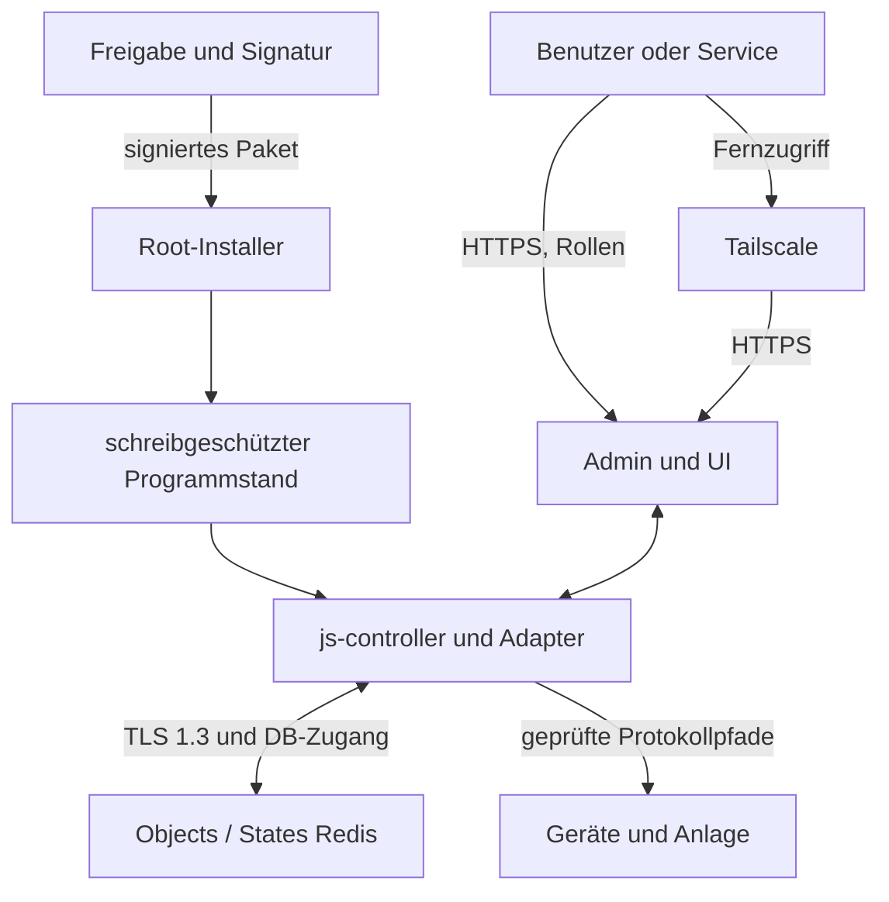

# NexoWatt EOS: integrierte Systemarchitektur

Stand: 1. Oktober 2026, Entwicklungszweig `0.2.0-dev.3`. Dieses Dokument beschreibt die vorhandene Basis, die laufende Integration und die verbleibenden Freigabegrenzen. Es ist weder eine Konformitätserklärung noch ein Hardwareprüfbericht. Die zugehörigen Quellkomponenten liegen vollständig unter `components/`; ihre tatsächlich vorliegenden Versionen und Lockdateien stehen in `system/integration/components.json`.

## Produktgrenze und Erhalt der Funktionen

Dieses zusammengeführte Repository ist die Hauptquelle für das EOS-Produkt, seine Komponenten und Nachweise. Die sichtbare Produktmarke ist NexoWatt EOS; technische ioBroker-Schnittstellen, Paketnamen und Lizenzhinweise bleiben nachvollziehbar. EOS wird als gemeinsam gepflegte Linux-Appliance entwickelt: Debian/Raspberry Pi OS 12 auf Raspberry Pi 5 mit SSD, 8 oder 16 GB RAM; zusätzlich x86_64 für Entwicklung und VM-Tests. Es entsteht kein eigener Linux-Kernel und keine selbst entwickelte JavaScript-Laufzeit. Node.js 24.21.0 und js-controller 7.2.2 bleiben versionierte Basiskomponenten. Der Node-LTS-Patchvertrag wurde für diesen Teststand aktualisiert; eine eigene Runtime wird nicht eingeführt.

Admin 7, das vorhandene NexoWatt-UI-Design und die Energie-, Lade-, Speicher-, Netz- und Gerätefunktionen bleiben Quellbestandteile. Vorhandener Quellcode, erfolgreich installierte npm-Pakete, freigegebene Pakete und laufende Adapterinstanzen sind getrennte Zustände. Ein vollständiger Quellstand oder eine erfolgreiche Paketinstallation beweist noch keine Funktionsfähigkeit aller Geräte.

| Modul | vorliegende Version | Zuständigkeit | Integrationsgrenze |
| --- | --- | --- | --- |
| js-controller | 7.2.2, EOS-Profil | Adapterprozesse, Objekte, States, Nachrichten | Paketinstallation und Hostbefehle im Laufzeitprofil eingeschränkt |
| EOS Admin | 7.10.11, EOS-Entwicklungsstand | Serviceadministration, begrenzte Installateurwege, eigene Passwörter, zentrale Lizenzprüfung | feste hostseitige Rollen; generische Adminrechte nur für NexoWatt Service |
| NexoWatt UI | 1.0.21, Sicherheits-Entwicklungsstand | Bedienung, Visualisierung, EMS | bestehende Funktionsnamen/Regelung erhalten; Lizenz- und HTTPS-Integration gesondert |
| NexoWatt Devices | 0.5.169 | Geräteprotokolle und Datenpunkte | hardware- und protokollspezifische Prüfung nötig |
| EEBUS | 0.3.0 | EEBUS-/CLS-Kommunikation | veralteter Quell-Lock ersetzt, deklarierter TypeScript-5.9.3-Build separat nachgewiesen |
| OCPP21 | 0.4.0 | Ladepunktkommunikation | keine ursprüngliche Lockdatei; neue konkrete Buildauflösung dokumentiert |
| NexoWatt Backup | 1.0.10 | Sicherung/Wiederherstellung | Hostrechte, Cloudpfade und Abhängigkeiten noch prüfpflichtig |

## Vertrauensgrenzen

Die obere Grenze ist die Softwarelieferkette: Signierschlüssel verbleiben außerhalb des Repositorys und außerhalb des Geräts. Der privilegierte Installer prüft die Signatur, den vollständigen Dateibaum und die Produkt-/Versionsbindung. Ein freigegebenes Paket darf keine beliebigen zusätzlichen npm-Module oder ungeprüfte Hostbefehle nachladen.

Die nächste Grenze liegt zwischen Betriebssystem und Laufzeit. Programmdateien werden durch root verwaltet. `eos-runtime` bekommt keine sudo- oder Docker-Rechte. Die systemd-Einheiten begrenzen Rechte und beschreibbare Pfade. Die zwei Redis-Dienste benutzen eigene Dienstkonten. Die tatsächliche Wirkung dieser Einstellungen unter Debian 12 und auf dem Pi muss auf dem Zielsystem geprüft werden; bisherige Sandbox-Tests ersetzen diese Prüfung nicht.

**Innerhalb von `eos-runtime` bilden js-controller und seine Adapter weiterhin eine gemeinsame Vertrauenszone.** Signierte und geprüfte Adapter sind nicht dadurch untereinander isoliert, dass sie separate Node-Prozesse sind. Gemeinsam verwendete Datenbankidentitäten und Dateirechte begrenzen die Trennung. Eigene Benutzer/Identitäten pro Adapter, feinere DB-Berechtigungen und ein gesonderter privilegierter Backupdienst sind weiterführende Maßnahmen; keine davon darf ohne Umsetzung als bereits vorhandene Absicherung bezeichnet werden.

## Kommunikationsarchitektur

| Verbindung | Absicherung / vorgesehenes Profil | Was damit nicht nachgewiesen ist |
| --- | --- | --- |
| Controller/Adapter → Objects-/States-Redis | TLS 1.3, CA- und Namensprüfung, getrennte zufällige DB-Passwörter, Klartextport aus; Bindung an Loopback | keine eigene mTLS-Identität je Adapter; kein Schutz vor beliebigem Code eines bereits kompromittierten Adapters mit denselben Rechten |
| Browser → EOS Admin/UI | TLS 1.3, serverseitige Anmeldung, feste Rollen und Sitzungswiderruf; Erstpasswortwechsel vor Produktzugriff | VPN ersetzt keine Rollenprüfung; grafische Browser- und Zielhost-Abnahme bleiben gesondert erforderlich |
| Mesh-/M2M-Client → UI | aktuelle allgemeine HTTP-Anmeldung; anonyme Aufrufe erhalten 401 | unbeaufsichtigter Meshbetrieb ist im Preview gesperrt; keine gesonderte Maschinenidentität oder mTLS-Clientzulassung implementiert |
| Service → EOS | Tailscale mit explizit verwalteter Identität und Zugriffsregeln; lokale Netze bleiben nutzbar | Tailscale ist noch kein bestandener Zugriffstest und keine pauschale Freigabe sämtlicher Dienste |
| Adapter → physische Geräte | TLS/Gegenstellenprüfung soweit Protokoll unterstützt; sonst dokumentierte lokale Vertrauensgrenze | Redis-TLS verschlüsselt weder Modbus TCP/RTU noch alle HTTP-, MQTT-, OCPP- oder EEBUS-Pfade automatisch |
| Adapter → externer HTTPS-Dienst | tatsächliches Gesamtzeitbudget ≤ 5 s, begrenzte Antwortgröße, geprüfte Daten und Fehlerzustände nach Programmierlinie | keine neue dauerhafte Cloudabhängigkeit für lokale Regelung |

States und Nachrichten werden über die geschützten Datenbankverbindungen transportiert. Redis-PubSub liefert über Verbindungsabbrüche hinweg keine garantierte lückenlose Nachrichtenfolge. Geräteadapter müssen Verbindungsausfälle erkennen, nach Wiederverbindung den aktuellen Zustand abgleichen und veraltete Werte kenntlich machen. Leistungsgrenzen, §14a-Vorgaben und Schutzfunktionen dürfen nicht allein von einer zuletzt empfangenen Nachricht abhängen. Konkrete gerätespezifische Failsafes sind mit echten Geräten zu prüfen.

## Start, Einrichtung und Lizenzierung

Die implementierte Kernbasis prüft vor dem Start die signierten Programmdateien und die TLS-Verbindungen. Anschließend läuft ein begrenzter Initialisierungsschritt; der Controller gilt erst nach frischem Alive-Zeitstempel, passender Prozesskennung und erwarteter Version als bereit. Standardzugänge, Diagnoseübertragung, beliebige Repositories und automatische Adapterinstallation sind nicht Bestandteil dieses sicheren Kernprofils.

Die Integration ergänzt diesen Start durch `runtime/bootstrap/enrollment.cjs`, die Kontenpolicy in `runtime/bootstrap/accounts.cjs` und den lokalen Root-Aufruf `tools/system/onboard-ui.cjs`. Das feste Laborprofil `eos-integrated-ui-lab-v1` umfasst genau EOS Admin auf Port 8081 und NexoWatt UI auf Port 8188. Physische Steuerung und Geräteadapter gehören nicht zu diesem Profil. Der Profilname bleibt erhalten; der Enrollmentmarker hat für die neue Kontenpolitik **Version 2**. Alte Marker der Lieferung `0.2.0-dev.1` werden nicht still migriert. Für die Abnahme dieses Entwicklungsstands wird ein frischer Kern-Snapshot eingerichtet.

Einrichtungsdaten kommen über genau vier Optionen aus geschützten Dateien: `--password-file` für das gerätebezogene Servicepasswort, `--accounts-file` für die persönlichen Konten, `--license-trust` und `--hosts-file`. Der Serviceadministrator heißt technisch `system.user.admin`; er gehört ausschließlich zum NexoWatt-Servicezugang. Die Kontendatei enthält 2 bis 16 persönliche Konten, mindestens einen Installateur und einen Benutzer. Namen und Startpasswörter müssen untereinander eindeutig sein; keines dieser Passwörter darf dem Servicepasswort entsprechen. Passwörter haben 15 bis 128 Unicode-Zeichen, höchstens 256 UTF-8-Bytes und keine Steuerzeichen. Gespeichert wird ein Controller-kompatibler PBKDF2-HMAC-SHA256-Hash mit 600.000 Iterationen und individuellem Salt. Ein gemeinsames Standardpasswort wird nicht angelegt.

Hosteinrichtung und Browseranmeldung haben unterschiedliche Befugnisse: Nur die vertraute lokale Einrichtung weist die Rollen `installer` und `enduser` den festen Gruppen `system.group.installateur` und `system.group.endkunde` zu. Die generischen ioBroker-ACLs dieser Gruppen sind vollständig ausgeschaltet; Benutzer- und Gruppenobjekte sind mit Objekt-ACL `0x600` dem Serviceadministrator vorbehalten. Die Webanwendungen erlauben ausschließlich die jeweils vorgesehenen Produktendpunkte. Ein Rollenfeld in der Anmeldung oder Passwortänderung verleiht keine Rechte. Änderungen an Mitgliedschaften, zusätzlichen Konten oder ACLs werden gegen das Enrollmentinventar geprüft.

Installateur und Benutzer melden sich zunächst mit einem individuell übergebenen Startpasswort an. Solange `nexowattPasswordChangeRequired` gesetzt ist, bleiben Produktfunktionen gesperrt. Die eigene Passwortvergabe erfordert eine gültige Sitzung, die erneute Prüfung des bisherigen Passworts und einen ausdrücklichen anwendungsspezifischen Header. Browser-/Cookie-Anfragen verlangen dieselbe HTTPS-Origin; ausdrücklich authentifizierte Bearer-CLI-Anfragen an Admin dürfen ohne Origin erfolgen. Danach werden vorhandene Sitzungen widerrufen und eine erneute Anmeldung mit dem neuen Passwort verlangt. Auch spätere eigene Passwortänderungen wählen weder fremde Konten noch Rollen aus. Das ist ein authentifizierter Einrichtungsablauf, kein geheimnisloses Self-Service-Bootstrap und keine bereits implementierte MFA.

Die konkreten Admin-/UI-Rechte, Sonderfälle und STRIDE-Szenarien stehen in [BRANDING_ROLES_DE.md](../security/BRANDING_ROLES_DE.md). Aktuelle Prüfläufe und ihre Quellbindung stehen in `reports/integration/branding-roles/verification-summary.json`. Die erfolgreichen R4-Prozessprüfungen des Vorgängers gehören zu `0.2.0-dev.1` und belegen die jetzt geänderten Anmeldepfade nicht. Prozessprüfungen mit ausdrücklich gekennzeichneter OS-Schnittstellen-Fixture belegen weder native Netzwerkerkennung noch Debian-/Pi-Dienstbetrieb.

Die HTTPS-Schlüssel und Zertifikate liegen unter `/etc/nexowatt-eos/web/`; SAN-Namen werden ausdrücklich vorgegeben. Die lokale Web-CA behält ihren privaten Schlüssel in einem ausschließlich root zugänglichen Bereich für den Zertifikatslebenszyklus. Dieser CA-Schlüssel ist keine Paketdatei. Zertifikatserzeugung, Erneuerung, Browservertrauen, Ablauf und Wiederherstellung sind getrennt zu prüfen; erfolgreiche TLS-Unit-Tests belegen noch keinen vollständigen produktiven Zertifikatsbetrieb.

Die zentrale Lizenzinstanz liegt fachlich im EOS Admin. Herstellerfreigaben sollen mit öffentlichem Prüfschlüssel offline überprüfbar sein; der geheime Signierschlüssel gehört nicht auf das Gerät. Die gespeicherte Lizenz wird zusätzlich verschlüsselt. Adapter benötigen abgegrenzte Freischaltungsinformationen statt eines auslesbaren Herstellerschlüssels. Verschlüsselung auf demselben Gerät verhindert nicht automatisch, dass ein kompromittierter Prozess mit Zugriff auf den Entschlüsselungsschlüssel die Daten liest. Funktionsfreischaltung und Benutzerberechtigung bleiben getrennte Prüfungen. Änderungen an Lizenz- und Fehlerverhalten dürfen keine unkontrollierten physischen Anlagenzustände auslösen.

## Updates und zusätzliche Adapter

Das bestehende Paketverfahren arbeitet mit exakten Versionen, SHA-256-Dateihashes und Ed25519-Signaturen. Der Controller erhält eine unveränderliche Liste zulässiger Adapterpakete. Ein signierter Katalog enthält zusätzlich den tatsächlichen Prüfstatus und benötigte Rechte/Protokolle. `pending` bedeutet keine Freigabe.

Ein zusätzliches Paket wird zuerst außerhalb des Geräts gebaut, inventarisiert und geprüft. Nach Prüfung kann ein neuer signierter Gesamtstand entstehen. Die vorhandene additive Aktivierung unterstützt begrenzte Paketerweiterungen und einen Rückfall auf den alten Programmverweis. Dies ist kein allgemeiner Datenbankmigrations- oder Betriebssystem-Updater. Das integrierte Einrichtungsprofil akzeptiert derzeit ausdrücklich nur Admin und UI: `enrollment.verify` beziehungsweise `pinnedAdapters` lehnt ein Controllerprofil mit weiteren Adaptern ab. Die Installation und Aktivierung zusätzlicher Adapter ist für dieses integrierte Profil somit noch nicht abgeschlossen. Dafür werden ein erweitertes Profil, eine kontrollierte Migration und zugehörige Zulassungs-/Aktivierungstests benötigt; allein die Signatur eines weiteren Pakets genügt nicht. Installation des Codes und Aktivierung einer Instanz sind getrennte Entscheidungen; ein Installer darf einen unkonfigurierten Geräteadapter nicht versehentlich in Betrieb setzen.

Bei jedem neuen Adapter sind Schnittstellenvertrag, Rechte, Protokolle, interne DB-Verbindung, externe Gerätepfade, Schwachstellen, Lizenzen und Fehlerverhalten zu prüfen. Ein Herstellerkatalog allein ist kein Schutz gegen einen Benutzer oder Adapter, der noch beliebige Programme starten kann.

## Build und SBOM

Für `0.2.0-dev.3` arbeitet der Paketbau ausschließlich offline mit vorab
beschafften Abhängigkeiten. Linux-x64 und Linux-ARM64 werden ausdrücklich gewählt
und getrennt installiert; native Paketdaten und Binärheader werden vor Signatur
und Installation geprüft. Node 24.21.0 wird als exakter externer Laufzeitvertrag
gebunden. Esbuild 0.28.2 ersetzt die betroffene 0.11.23-Kopie im tatsächlichen
Controller-Loaderpfad; Controller und Loader bleiben unverändert.

`reports/integration/stabilization/` enthält die neuen plattformspezifischen
npm-SBOMs, Ein-/Ausgabebindungen und Prüfungen. Das signierte ARM64-Bundle liegt
unter `delivery/test-pi-0.2.0-test.1/`. Vorprüfung und Installation prüfen gemeinsam
Signatur, Katalog, SBOM-Bindung, Zielarchitektur, Systemwerkzeuge und erforderliche
Ports. Die Vorprüfung validiert auch die geschützten Einrichtungsdateien. Der
Betriebsweg ist im [Test-Pi-Handbuch](../operations/TEST_PI_INSTALLATION_DE.md)
beschrieben; Redis-TLS und Hardwarebetrieb müssen auf dem Pi tatsächlich folgen.
Ein vollständiger neuer Online-EOS-Audit wurde wegen der möglichen Übermittlung
privater Paketmetadaten gesperrt. Öffentliche Teilprüfungen ersetzen ihn nicht.

`tools/integration/build-runtime.cjs` kopiert Quellstände in ein frisches externes Arbeitsverzeichnis, prüft vorhandene Einstiegspunkte und erzeugt npm-Archive mit deaktivierten Lifecycle-Skripten. Kompilierung ist ein eigener, explizit geprüfter Schritt. Explizite Abhängigkeits-Overrides der Komponenten werden am Installationsroot zusammengeführt; Konflikte stoppen den Build, weil npm untergeordnete Overrides nicht automatisch durchsetzt. Die tatsächliche Installation verwendet eine konkrete Lockdatei und keine Lifecycle-Hooks. Danach werden die Root-Abhängigkeiten auf die beobachteten exakten Paketversionen normalisiert; lokale Archive bleiben über `resolved` und ihre SHA-512-Integrität an die Lockdatei gebunden. Ein frischer `npm ci`-Durchlauf überprüft diese Kombination.

Es gibt bewusst getrennte Nachweise:

1. `system/integration/components.json` und `source-lock-inventory.cdx.json`: vorhandene Quellen und deklarierte Lockeinträge, einschließlich Build-/Frontend-Abhängigkeiten; kein Nachweis des installierten oder gebündelten Produkts.
2. `assessment-tree.cdx.json` und `.coverage.json`: tatsächlich installierter npm-Baum der isolierten Bewertung aller sechs Komponenten, ergänzt um die im Paketbaum vorhandenen eingebetteten Pakete `crypto-js` und `@nexowatt/eos-license-client`. Dieser Baum ist nicht zur Geräteinstallation freigegeben.
3. Für den Vorgänger `0.2.0-dev.1`: `candidate-final-tree.cdx.json` mit zugehöriger Coverage und Schema-Prüfung: tatsächlich installierter Admin-/UI-Laborbaum mit 465 npm-Paketverzeichnissen, 425 unterschiedlichen npm-Komponenten und zwei eingebetteten Paketen. Die Änderungen an Controller und CLI sind über den Transformationsnachweis gebunden. Das zugehörige Audit meldet drei moderate Paketknoten derselben esbuild-Abhängigkeitskette; keine hohe/kritische Meldung in diesem konkreten Kandidaten. Dies ist keine Aussage über das gesamte Produkt oder die physische Anlagensteuerung.
4. Für `0.2.0-dev.2`: `reports/integration/sbom/branding-roles/` bindet den neu erzeugten Admin-/UI-Baum an die geänderten Marken-, Anmelde- und Rollendateien. Das vorangegangene SBOM- und Auditresultat ist kein aktueller Nachweis für diesen Build; maßgeblich sind die dortigen Eingabehashes, Ergebnisse und der aktuelle Integrationsbericht.
5. Geräteinventar nach Installation: OS-Pakete, Node-/Redis-Binaries, Firmware und konkrete Konfiguration. Es liegt nicht allein durch die npm-SBOM vor.

Die Admin-WebSocket-Bibliothek `@iobroker/ws-server@4.5.1` ist im aktuellen
Build zusätzlich lokal verändert: Ein hashgebundener Schritt begrenzt den
entpackten Eingang auf 1 MiB je Nachricht vor der Kommandoauswertung. Die
Buildprüfung bindet die tatsächlich durch Admin aufgelöste Bibliothekskopie.
SBOM und Transformationsbeleg kennzeichnen diese Ableitung; Upstream-Archivhashes
beschreiben deren Vorgänger. Diese Grenze ist keine umfassende DoS-Abnahme.

Die gebündelten Browserdateien sind durch Dateihashes erfassbar. Welche Frontend-Abhängigkeiten darin tatsächlich enthalten sind, erfordert zusätzlich einen nachvollziehbaren Frontend-Build beziehungsweise einen geeigneten Buildnachweis. Frontend-Lockdateien werden nicht als bewiesener Bundleinhalt ausgegeben. native Node-Erweiterungen, zum Beispiel für Serialport, benötigen eine Prüfung der tatsächlich verwendeten Architektur und Binärartefakte.

Der ursprüngliche Admin-Lockeintrag für `@iobroker/ws@3.1.0` wich von Registry-Metadaten und unabhängig heruntergeladenen Archivbytes ab. Der Befund und die konkreten Hashes stehen in `reports/integration/sbom/admin-ws-integrity.json`; eine Integritätsprüfung darf nicht umgangen werden. Der initiale vollständige Bewertungsbaum enthält weitere npm-Advisory-Befunde. Nach Admin-Nachbesserung ergibt der gesonderte vollständige Bewertungsbaum noch zwölf gemeldete Paketknoten (zwei kritisch, zehn moderat), unter anderem im Backup-Zweig; er bleibt gesperrt und ist nicht der Admin-/UI-Kandidat. Dieser Snapshot entstand vor den abschließenden EEBUS-Protokollkorrekturen. Der Auditbericht zählt betroffene Paketknoten und darf nicht als Anzahl unabhängiger CVEs gelesen werden.

Die konkreten Archive und exakten App-Lockdateien des jeweils dokumentierten Admin-/UI-Kandidaten werden unter `delivery/reproducible-roles-lab/` zusammen aufbewahrt. Die Reproduktionsnachweise nennen den zugehörigen Produktstand; ein erfolgreicher `npm ci --ignore-scripts` des Vorgängers wird nicht als Nachweis für neu geänderte Archive übernommen. Ein anschließender separater Schritt transformiert den Controller; dabei wird auch der automatische Host-`setcap`-Pfad entfernt. Die detaillierten Eingabehashes und die Anleitung liegen im Reproduktionsordner. Das sind Build-Eingaben, kein signiertes Installationspaket.

## Bedrohungsmodell des Build-/Inventarwegs

| STRIDE | Bedrohung | Umsetzung / Nachweis | Grenze |
| --- | --- | --- | --- |
| Spoofing | anderes Paket unter erwartetem Namen | Name/Version im installierten Manifest und Lock abgleichen; npm-Aliase nur mit ausdrücklichem `entry.name` | Freigabe des tatsächlichen Herausgebers bleibt Lieferkettenprozess |
| Tampering | veränderte Archive oder Programmdateien | SRI im Lock, Archiv-SHA256, signierter vollständiger Runtime-Dateibaum | Buildhost und Signierschlüssel müssen geschützt sein |
| Repudiation | unklarer geprüfter Stand | getrennte Quellen-/Buildinventare, Kommandos, Hashes und Prüfberichte | keine fiktive unabhängige Freigabe |
| Information Disclosure | Geheimnisse im Paket oder Bericht | keine privaten Schlüssel vorgesehen, begrenzte Meldungen und gesonderte Inhaltsprüfung vor Lieferung | npm-Log- und Quellinhalt müssen weiterhin geprüft werden |
| Denial of Service | grenzenloser Build, große Eingaben, Paket-Hooks | frisches externes Verzeichnis, Datei-/Bytegrenzen, kein Shellaufruf, npm-Zeitlimit, Lifecycle-Hooks aus | npm-Entpacken ist ein Buildhost-Vorgang und kein formaler Sandboxbeweis |
| Elevation of Privilege | Paket-Hook übernimmt Host | Installation ohne Lifecycle-Hooks; Buildwerkzeug ist keine Adapter-/Root-Service-API | manuell freigegebene Compiler führen weiterhin Buildcode aus |

## CRA-/IEC-Nachweise und offene Abnahme

Die Entwicklung wird an der vereinbarten Programmierlinie und den ausgewählten Anforderungen aus IEC 62443, OWASP ASVS und NIST SSDF ausgerichtet. Für CRA müssen Produktabgrenzung, Risikoanalyse, Schwachstellenbehandlung, Support- und Aktualisierungsprozesse sowie das tatsächlich erforderliche Konformitätsverfahren als eigener Nachweis fortgeführt werden. Eine SBOM, TLS, ein Audit oder diese Architektur allein ergeben keine vollständige Konformität.

Für den Zertifikatslebenszyklus existieren inzwischen eigene Bausteine unter `runtime/transport/certificate-lifecycle.cjs`, `web-renewal.cjs` und `tools/system/rotate-certificates.cjs` sowie systemd-Dienst/Timer. Vorbereitete Rotation, Wartungssperre, Journal und Wiederanlauf werden separat geprüft; ihre Existenz allein belegt noch keinen störungsfreien Pi-Betrieb.

Der frühere r2-Prozess-/Browserlauf hat 14 Stufen bestanden. Der neue Liefernachweis bindet den erneuten Prozesslauf an den aktualisierten Kandidaten. Das vollständige UI-Pflichtgate bleibt rot: Die neue Diagnose belegt reale Überschreitungen des 200-ms-Anfragebudgets. Die alte erfolgreiche RTT war keine Messung des fehlgeschlagenen Versuchs. Ein nachfolgender erfolgreicher Teillauf schließt den sporadischen Fehler nicht; der integrierte Laborstart startet keinen Mesh-Koordinator.

Offen bleiben insbesondere: MFA und eine abgenommene Servicezugangs-/Wiederherstellungsorganisation; tatsächlicher Debian-12/Pi-Betrieb mit unprivilegierten Konten und schreibgeschützten Codepfaden; vollständige Einrichtung; Zertifikatslebenszyklus; überprüfter Tailscale-Zugang; direkte Geräteprotokolle; physische Failsafes; signierte Updates samt Datenmigration und Stromausfallbehandlung; verschlüsselte Sicherung und echte Wiederherstellung; bewertete und behobene relevante Abhängigkeitsbefunde. Die konkreten Abschlussstände werden in den Integrationsberichten nachgeführt.

Die nachgeführte Anforderungszuordnung und die Integrationsrisiken stehen in `docs/cra/INTEGRATED_TEST_REQUIREMENTS.md` und `docs/security/INTEGRATED_TEST_THREATS.md`. Geplante Abnahmeszenarien werden dort getrennt von tatsächlich ausgeführten Laborprüfungen geführt.

## Fortschreibung 0.2.0-dev.4: externe Redis-Komponente

`EOS-HOST-REDIS-20261001` hält neue Installationen an. Ein signierter
npm-Dateibaum deckt separat installierte Hostpakete nicht ab. Die aktuelle
Vorprüfung trennt technische Diagnose (`prerequisitesReady`) von Freigabe
(`ready: false`). Das frühere Testpaket bleibt unverändert historisch erhalten,
ist aber für Neuinstallationen zurückgezogen; kein technischer Offlinewiderruf
wird behauptet. Befund, konkrete Quellen und Testgrenzen stehen in
`docs/security/DEBIAN13_TEST_HOST_DE.md`, die Hashbindung in
`reports/integration/debian13/verification-summary.json`. Debian-13-/ARM64-
Betrieb und genaue OS-/Redis-SBOM bleiben offen. Die bestehende npm-SBOM
beschreibt den unveränderten App-Build, nicht die gesamte Produktversion.

## Fortschreibung 0.2.0-dev.5: OS-Sicherheitsupdates

Die automatische Debian-Paketpflege erhält einen eigenen privilegierten
Wartungsdienst, getrennt von Controller und Adaptern. Er verwendet APT mit
festen signierten Paketquellen und `unattended-upgrades`. Das gewöhnliche
EOS-Dienstkonto erhält dafür weder sudo-Rechte noch einen Steuerkanal zu Root.
Nur eine typgeprüfte Statuszusammenfassung geht über die vorhandene
authentifizierte UI-API an angemeldete Benutzer. Richtlinie und Status liegen
unter `/etc/nexowatt-eos-os-updates` beziehungsweise
`/var/lib/nexowatt-eos-os-updates`, außerhalb der EOS-Schreibverzeichnisse.

OS-Paketpflege, signierte EOS-/Adapterlieferung und die Pflege der genau
festgelegten Node-Laufzeit sind unterschiedliche Updategrenzen. Die Anzeige
führt fehlgeschlagene Läufe, blockierte Pakete, Aktualität, Timerzustand und
Aktivierungsbedarf getrennt. Ein Paketupdate allein beweist nicht, dass alle
laufenden Prozesse die Korrektur nutzen. Ein automatischer Rechnerneustart
ist nicht vorgesehen; Paket-Skripte können Dienste dennoch neu starten.
Anlagensicherheit und Stromverlustverhalten bleiben Zielprüfungen.

Umfang, STRIDE, CRA-Bezug und Grenzen:
[`OS_SECURITY_UPDATES_DE.md`](../security/OS_SECURITY_UPDATES_DE.md).
Dieser Quellstand ist kein neues signiertes Pi-Installationspaket. Die spätere
Nutzerentscheidung öffnet die Backend-Auswahl erneut. SQLite/SQLCipher und
Valkey werden in [der Architekturprüfung](DATABASE_TRANSPORT_OPTIONS_DE.md)
bewertet. Die oben beschriebene Redis-Implementierung ist der bisherige
Quellstand, keine erneuerte Freigabe oder verbindliche Zielentscheidung.
Eine Migration und Identitäten pro Adapter sind noch nicht umgesetzt.

## Fortschreibung 0.2.0-dev.6: PostgreSQL als Ziel

Fortschreibung dev7/test.2: [PostgreSQL-Hostprofil](POSTGRESQL_TEST_HOST_DE.md)
mit signiertem ARM64-Testinstaller, getrenntem Datenbankdienst, TLS-/SQL-
Zielprüfungen und begrenzter Admin-/UI-Einrichtung. Keine Pi-Abnahme behauptet.

Die Nutzerentscheidung vom 01.10.2026 legt PostgreSQL als Zielbackend fest.
Die zuvor beschriebenen Redis-Pfade dokumentieren den bisherigen Quellstand;
sie sind keine erneuerte Freigabe. Die neuen Objects-/States-Clients verwenden
die vorhandene Backend-Erweiterung des js-controllers 7.2.2. Die konkrete
Architektur, RLS-Datenklassen, TLS-Grenzen, Transaktionen, Ereignisverarbeitung
und STRIDE stehen in [runtime/postgresql/README.md](../../runtime/postgresql/README.md).

Die Backendpakete sind implementiert und in eine separate Labor-Kopie
integrierbar. Native PostgreSQL-/Controller-Prozesstests, Adapterisolation,
Bestandsmigration und Hostinstaller bleiben Freigabegates. Alte und neue
Testberichte gelten jeweils nur für ihre gebundenen Dateien und Prüfarten.
