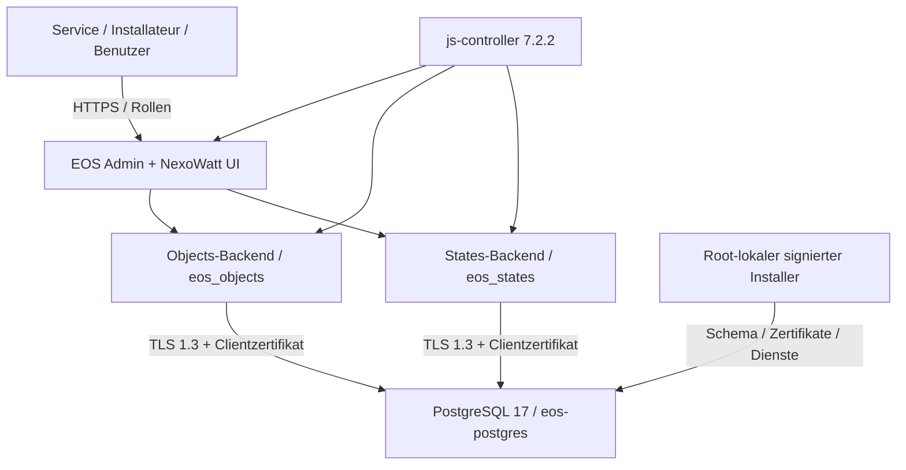

# PostgreSQL-Hostprofil 0.2.0-test.2

Fortschreibung vom 02.10.2026 zur bestehenden Architektur. UI-Design, Rollenmodell und ioBroker-Adapter-APIs bleiben erhalten; die Austauschbarkeit der Datenbank wird über feste Backendpakete umgesetzt. Ein erfolgreicher Build beweist keine vollständige ioBroker-Kompatibilität aller Views/Adapter.

Die TLS-Verbindungen enden am Datenbankserver. Das ist transportverschlüsselte Adapterkommunikation über Objects/States und Ereignisse, keine Ende-zu-Ende-Verschlüsselung gegen den Datenbankadministrator und keine physische Feldbusabsicherung.

| Vertrag | Implementierung / Grenze |
|---|---|
| Auswahl | Beide Stores `type=postgresql`; nur feste statische Modulnamen; gemeinsames signiertes Katalogprofil |
| Verbindung | 127.0.0.1:15432, DB `eos`, Rollen `eos_objects`/`eos_states`, CA+eigener Schlüssel/Zertifikat; kein Passwort-/Klartextfallback |
| Persistenz | SQL-Transaktionen, bytea-Werte, getrennte RLS-Domänen, Schema-Version 1 |
| Ereignisse | Persistierte begrenzte Ereigniszeilen und opaque PostgreSQL-NOTIFY-IDs; empfangene Werte werden innerhalb der autorisierten Domäne gelesen |
| Bootstrap | Neues privates Cluster → Schema/Grants → 18 echte Zielprüfungen → ioBroker setup → Härtung/Marker → Controller-PID/Heartbeat |
| Ersteinrichtung | Root-lokale geschützte Eingaben → Service-/Installer-/Benutzerrollen → zwei freigegebene Adapter → Upload → Heartbeat und HTTPS-Prüfung |
| Erweiterungen | Keine URL-/npm-Nachinstallation aus dem Runtimekonto. Neue Adapter benötigen zusätzlich geprüfte Quellen, Profil, SBOM, signiertes Bundle und Kompatibilitätstests |
| Netzwerk | Datenbank nur Loopback. Adapterprozesse behalten AF_INET/INET6/NETLINK für benötigte Protokolle; LAN-/VPN-Regeln außerhalb der DB separat bestimmen |
| Updates | Distributionspakete über getrennten Root-Updater; unveränderliche App-/Node-Version nur über erneut geprüftes Release. Kein unbeaufsichtigter Reboot |

Systemd-Dateien: `system/postgresql-test/systemd/`. Installer: `tools/system/install-postgresql-host.cjs`. TLS-/Clusterprovisionierung: `runtime/postgresql/host.cjs`. Native Zielprüfung: `runtime/postgresql/acceptance.cjs`. Die Root-CA und der PostgreSQL-Superuser sind niemals Adaptercredentials.

In test.2 wird kein Redis-Server gestartet. Der Redis-Altpfad samt Sperre bleibt für historische Nachvollziehbarkeit im Quellbestand. Die zwei Rollen sind nicht mit einer Rolle je Adapter zu verwechseln. Gemeinsames `eos-runtime` bleibt eine offene Isolationsgrenze.
