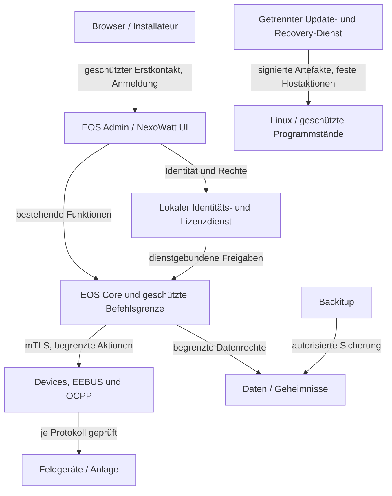

# NexoWatt EOS: High-Level-Architektur

Stand 30.09.2026; Architekturrevision `2026-09-30.3`. Die Architektur ergänzt den Installer-Härtungskandidaten um Quellbeobachtungen, das aktuelle Nutzer-UI-Archiv und das gemeldete RPi-5-Profil. Die beschriebenen neuen Dienste, Prozessgrenzen und Netzwerkregeln sind **Zielarchitektur**, keine bereits installierte Laufzeit und keine CRA-Konformitätsbescheinigung.

## Produkt und Bestand erhalten

EOS wird als zusammengehöriges Linux-System mit festgelegten Komponenten, gemeinsamer Installation und geprüftem Update ausgeliefert. Kernel und Treiber stammen aus einer gewarteten Linux-Basis; ein eigener Kernel ist nicht Teil dieses Vorhabens. Die Freigabe erfolgt je Hardwareprofil. ARM64, x86-64 und ein konkreter WAGO Edge Controller dürfen nicht ohne eigene Nachweise gleichgesetzt werden.

Die vorhandenen Oberflächen von EOS Admin und NexoWatt UI, Navigation, Rollen, Gerätezuordnungen, Datenpunktnamen, Einheiten, Lade-/Speicher-/Netzregeln und Offlinefunktionen sollen erhalten bleiben. Eine Kompatibilitätsschicht bildet bestehende Aufrufe auf neue geschützte Schnittstellen ab. Neue Sicherheitsprüfungen werden im Backend durchgesetzt. Notwendige Sicherheitsmigrationen werden dokumentiert und auf Funktionsverträglichkeit geprüft.

Der Nutzer meldet Admin 7 als produktiven Ausgangsstand. Ein automatischer Wechsel auf Admin 8 ist nicht beschlossen. Die frühere Quellprüfung von Upstream Admin 8 belegt nicht das Verhalten des produktiven EOS Admin 7. Beobachtete Quellen für Admin 7, Devices, Backitup, EEBUS, OCPP, js-controller und Adapter-Core sind in `system/components/source-inventory.json` commitgebunden erfasst. Das nachgereichte aktuelle UI-Archiv 1.0.21 ist durch Archivhash gebunden, ohne erfundenen Git-Commit. Der tatsächliche Gerätebestand und vollständige visuelle/funktionale Baselines sind noch nicht erhoben; Erhalt bleibt eine verbindliche, noch nicht bestandene Anforderung. Details: `docs/integration/SOURCE_BASELINE.md` und `docs/hardware/RPI5_PROFILE.md`.

## Module und Isolation

**Ist-Struktur der nachgereichten UI 1.0.21:** Der heutige UI-Adapter enthält neben Webbedienung auch EMS-/Core-, Lade-, Speicher-, Netz- und Mesh-Regelung. Die nachstehenden Module sind logische Zielgrenzen, keine bereits getrennten Pakete. Ein Abtrennen oder Neustarten des heutigen UI-Prozesses kann deshalb Regelung betreffen. Die Migration muss diese Laufzeitanteile, Datenpunkte, Reihenfolge, Fristen und Fehlerzustände ausdrücklich erhalten; sie darf die UI nicht als bloße Anzeige behandeln. Quell-/Fixture-Baseline: `docs/integration/UI_COMPATIBILITY_BASELINE.md`.

| Modul | Aufgabe | Zielschutz und Grenze |
|---|---|---|
| Linux-Systembasis | Boot, Kernel, Treiber und OS-Pflege | Minimale Pakete; keine Standardpasswörter; Debug und allgemeiner Fernzugriff aus; verifizierter Boot, soweit die konkrete Hardware dies unterstützt und ein durchgängiges Schlüsselkonzept vorliegt. |
| EOS Core / Controller | Vorhandene Regelung, Zustand und Adapterkoordination | Eigene unprivilegierte Identität; keine Paketverwaltung; begrenzte Ressourcen; Regeln und Gerätegrenzen vor Befehlsausgabe prüfen. |
| EOS Admin und NexoWatt UI | Bestehende Bedienung und Verwaltung | Sichere Browserverbindung bereits ab Erstkontakt, getrennte Rollen und serverseitige Autorisierung. UI-Sichtbarkeit ist keine Berechtigungskontrolle. |
| Identitäts- und Lizenzdienst | Konten, lokale Lizenzprüfung, eingeschränkte Freigaben | Getrennte unprivilegierte Identität, geschützte Schlüsselablage; keine privaten Lizenz-Ausstellerschlüssel auf Kundenhardware; keine Root-Wartungsrechte. |
| Kommunikationsgrenze | Authentifizierte, autorisierte Modulaufrufe | TLS 1.3 und gegenseitige Dienstidentität für Netzwerkaufrufe; eigene Berechtigung je Aktion; Größen-, Zeit-, Sequenz- und Wiederholungskontrollen. |
| Devices, EEBUS und OCPP | Gerätekommunikation und Kopplung | Eng begrenzte Netzwerk-/Gerätefreigaben; jedes unterstützte Protokoll separat bewerten. Unverschlüsseltes Modbus wird durch interne TLS-Verbindungen nicht nachträglich verschlüsselt. |
| Daten- und Geheimnisablage | Zustände, Konfiguration, Schlüssel | Datenzugriffe auf notwendige Bereiche begrenzen. Geheimnisse außerhalb allgemein auslesbarer ioBroker-States/Basiseinstellungen; Rotation, Restore und Löschung festlegen. |
| Update und Recovery | Verifizierte Lieferung und Wiederanlauf | Netzwerkdownload unprivilegiert; kleiner privilegierter Helfer mit festen Aktionen und verifizierten Artefakten. Atomarer Wechsel, Boot-/Funktionsprüfung und passende Datenmigration. |
| Backitup | Sicherung und Wiederherstellung | Verschlüsselte authentisierte Backups; Rechte, Pfade und Größen bei Restore prüfen; Restore geordnet und autorisiert. Schlüsselwiederherstellung gesondert planen. |
| Audit und Zustand | Diagnose, Sicherheitsereignisse, Ressourcen | Keine Geheimnisse im Log; Rate-/Größenlimits und Rotation; getrennte Schreibrechte. Ein kompromittierter Root-Nutzer kann lokale Nachweise weiter beeinflussen. |

Einzelne Geräteadapter sollen langfristig eigene Betriebssystemidentitäten oder entsprechend geprüfte Sandboxes erhalten. **Der bisherige ioBroker-Betrieb mit gemeinsamer Dienstidentität ist noch keine solche Isolation.** Das Einführen eines neuen Dienstnamens, eines Containers oder von mTLS allein trennt keine gemeinsam lesbaren Schlüssel und keine gemeinsam beschreibbaren Datenbanken. Die genaue Controller-/Adapterintegration ist eine offene Implementierungsaufgabe.

## Vertrauensgrenzen und Datenfluss

Das Diagramm zeigt einen Entwurf. Die maschinenlesbare Fassung in `system/product-plan.json` markiert sämtliche neuen Verbindungen als `implemented:false`. Lokale privilegierte Hostoperationen verwenden eine geschützte Unix-Socket-Schnittstelle mit OS-Gegenstellenprüfung und zusätzlich verifizierten signierten Artefakten; sie sind kein allgemeiner Shellzugang. Zwischen den übrigen Netzwerkdiensten ist gegenseitige kryptografische Authentifizierung das Ziel. Berechtigungen werden aus dem verifizierten Kontext abgeleitet, nie aus einer frei angegebenen Absenderkennung.

## Sicherer erster Start und Lizenz

Vor Freischaltung steht ausschließlich eine begrenzte Einrichtung und autorisierte Wiederherstellung bereit. Schon der erste Passwort- und Lizenztransport muss geschützt sein: geräteindividuelle Identität, unabhängig prüfbarer Fingerprint bzw. bereits vertrauenswürdig provisionierte Zertifikatskette und lokaler Besitznachweis. Ein generisches selbstsigniertes Zertifikat mit Aufforderung, Warnungen zu ignorieren, genügt nicht. Das genaue Provisionierungsverfahren ist je Hardwareprofil festzulegen.

Eine lokal geprüfte digitale Signatur belegt den Aussteller der Lizenz. Verschlüsselte Ablage schützt ihren Inhalt im Rahmen der Schlüsselgrenze. Adapter erhalten nur ihre jeweils erforderlichen Freigaben über authentifizierte Schnittstellen. Sie erhalten keinen gemeinsamen Entschlüsselungsschlüssel und können keine eigenen Berechtigungen ausstellen. Lizenzprüfung und Benutzeranmeldung bleiben getrennte Prüfungen. Geräteaustausch, Sicherungsrücksicherung, Uhrzeitfehler, Ablauf und Offline-Widerruf müssen ausdrücklich behandelt werden.

Vor erster kommerzieller Aktivierung sind Produktfunktionen gesperrt. Nach Inbetriebnahme dürfen Lizenzfehler keine unkontrollierte Abschaltung notwendiger Netz-/Anlagenschutzfunktionen auslösen. Der sichere Zustand muss gerätespezifisch festgelegt werden. Sicherheitswartung und autorisierte Wiederherstellung bleiben unabhängig von kommerziellen Zusatzfreigaben möglich. Gegen einen Besitzer mit vollständiger Kontrolle über Betriebssystem und Bootkette wird kein absoluter Kopierschutz zugesagt.

## Updates, Speicher und Lieferung

Ein EOS-Release referenziert exakte Komponentenstände und Prüfsummen, eine nachgewiesene Signatur, Zielhardware, Datenformatschemata und die zugehörigen Nachweise. Keine Installation aus einem veränderlichen `main`, `latest` oder `stable` als reproduzierbarer Lieferstand. Die Vertrauenswurzel für Signaturen wird vorab sicher ausgeliefert; ein zusammen mit einem beliebig ersetzbaren Installer geladener Schlüssel erzeugt keine unabhängige Vertrauensbasis.

Systemimage und Installation auf freigegebenem Linux sind zwei getrennte Lieferprofile. Ein A/B-Imageupdate ist eine Zieloption, sofern Bootloader, Speicherlayout und Recovery auf der Zielhardware geprüft sind. Es ersetzt keine rückwärtsverträgliche Datenmigration. Bei Stromausfall und fehlgeschlagener Funktionsprüfung müssen alter Programmstand und passender Datenstand gemeinsam wiederherstellbar sein. Hersteller-Sicherheitsupdates, verifizierte Rückfallszenarien und Schutz gegen beliebiges Zurücksetzen auf verwundbare Stände sind gemeinsam zu entwerfen.

## Erste Umsetzungsetappe

Neue sicherheitskritische native Dienste sollen vorzugsweise mit speichersicheren Ansätzen wie Rust umgesetzt werden. Bestehende Node.js-/TypeScript-Module bleiben zunächst erhalten; ihre nativen Abhängigkeiten müssen gesondert inventarisiert und geprüft werden. Speichersicherheit ersetzt weder strenge Eingabeprüfung noch Autorisierung, Zeitlimits und Ressourcenbegrenzung. Die in dieser Etappe geschriebenen Werkzeuge sind lokale Python-Prüfprogramme ohne Hostinstallation und ohne Netzwerkdienst.

In dieser Etappe entstehen Architekturplan, Schnittstellen-Schemas, STRIDE-Bedrohungen, Anforderungs-/Testzuordnung und lokale Prüfwerkzeuge ohne Hostkonfigurationsänderungen. Ein CycloneDX-1.7-Werkzeug bereitet aus belegbaren Quellen ein ausdrücklich unvollständiges Quellinventar in neuen Ausgabedateien vor. Eine vollständige Geräte-/Build-SBOM ist erst nach reproduzierbarem Build und Inventarisierung der tatsächlich enthaltenen Abhängigkeiten möglich.

Keine vorhandene UI-, Adapter- oder Regeldatei wird in dieser Etappe umgeschrieben. Vor Runtime-Integration folgen Import der tatsächlichen Quellen, Versions- und Lizenzinventar, visuelle/fachliche Baseline, geschützte Einrichtung auf isoliertem Abbild, schrittweise Integration und gerätebezogene Regression. CRA-Zuordnung und offene Freigabegates stehen in `docs/cra/SYSTEM_REQUIREMENTS.md` und `system/product-plan.json`.
