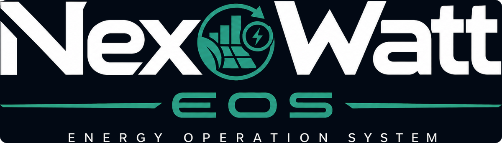
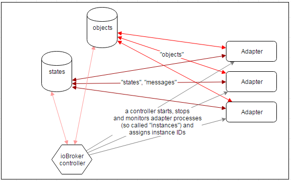

# Historischer README-Stand und ioBroker-Herkunft

Dieser unveränderte fachliche Upstream-/Prüftext stammt aus dem README des
Entwicklungsstands `0.2.0-dev.1`. Versions- und Statusaussagen sind historisch;
die darin genannten Upstream-Installationsbefehle installieren **nicht** das
NexoWatt-EOS-Hauptsystem. Maßgeblich ist das [aktuelle Produkt-README](../../README.md).
Relative Verweise wurden an diesen Ablageort angepasst. Urheberrechts- und
Lizenzhinweise bleiben erhalten.

**Status 2026-09-30: host hardening candidate, not production approved.** This repository contains ioBroker installation/maintenance tooling. It does not contain the complete EOS runtime or the individual EOS adapters.

The Linux/systemd profile now restricts host privileges and maintenance entry points, rejects the old plaintext Redis setup, and leaves installation stopped until secure provisioning and acceptance. The Admin wizard alone does not secure internal communication. Start with [acceptance and migration](../security/ACCEPTANCE.md), [parameters](../../PARAMETERS.md), [Admin evidence](../security/ADMIN_FIRST_RUN.md), and [runtime TLS](../security/RUNTIME_TLS.md).

The upstream information below is retained for attribution/context; its NPX and remote install commands do **not** install this review branch. Non-Linux delivery paths are outside this hardening scope.

**EOS system architecture foundation:** [High-level design](../architecture/SYSTEM_OVERVIEW.md), [implementation status and checks](../architecture/IMPLEMENTATION_STATUS.md), [interface contracts](../architecture/INTERFACE_CONTRACTS.md), [STRIDE model](../security/THREAT_MODEL_SYSTEM.md), [CRA evidence plan](../cra/SYSTEM_REQUIREMENTS.md), and [UI/function preservation](../operations/COMPATIBILITY_PLAN.md). This adds local development validators and a partial CycloneDX source inventory. New runtime services, module isolation and encrypted adapter integration are still to be implemented; existing UI and control code are not changed in this stage.

**Component integration scope:** [Pinned source observations and open findings](../integration/SOURCE_BASELINE.md) include js-controller and Adapter-Core explicitly, EOS Admin 7, Devices, EEBUS, OCPP, Backitup and the user-confirmed UI 1.0.21 archive. [Raspberry Pi 5 profile](../hardware/RPI5_PROFILE.md) covers the reported 8/16 GB variants with SSD. Source observations are not installed versions or an approved system release. The UI archive has an observed SHA-256; its Git commit is not known.

---

# ioBroker (Windows installer)

*Automate your life!*

To install on Linux, just run: `npx @iobroker/install`

To install on Windows: `mkdir C:\iobroker && cd C:\iobroker && npx @iobroker/install` or use [installer](https://github.com/ioBroker/ioBroker.build)

See [ioBroker documentation](https://www.iobroker.net/#en/documentation) for more information

* [ioBroker website](https://www.iobroker.net)
* [Forum](https://forum.iobroker.net)
* [Requests for adapters](https://github.com/ioBroker/AdapterRequests/issues)

ioBroker is an integration platform for the [Internet of Things](https://en.wikipedia.org/wiki/Internet_of_Things), focused on Building Automation, Smart Metering, Ambient Assisted Living, Process Automation, Visualization and Data Logging.

## Concept

ioBroker is not just an application, it's more of a concept and a database schema.
It offers a very easy way for systems to interoperate. 
ioBroker defines some common rules for a pair of databases used to exchange data and publish events between different systems.

### Databases

ioBroker uses an "in memory" database to hold the data and saves it on disk with reasonable intervals. 
There are two types of storage:
- objects (meta/configuration information)
- states (values)

Objects and states can be stored in "in memory" or in Redis.

[Redis](https://redis.io/) is an in-memory key-value data store and also a message broker with a `publish/subscribe` pattern.

It's used to maintain and publish all states of connected systems.

### Adapters

Systems are attached to ioBrokers databases via so-called adapters, technically processes running anywhere
in the network and connecting all kinds of systems to ioBrokers databases. 
A connection to ioBrokers databases can be implemented in nearly any programming language on nearly any platform, 
and an adapter can run on any host that is able to reach the databases via ip networking.

See the actual list of adapters on [iobroker.net](https://www.iobroker.net/#en/adapters)

### Security

ioBroker is designed to be accessed by trusted adapters inside trusted networks. 
This means that usually it is not a good idea to expose the ioBroker databases, 
adapters or any smart home devices directly to the internet or, in general, 
to an environment where untrusted clients can directly access these network services. 
Adapters that offer services supposed to be exposed to the internet should be handled with care. 
You should always activate **HTTPS** and use valid certificates for web admin if open it for internet or,  
for example, use it with additional security measures like VPN, VLAN and reverse proxies.

## Getting Started
### Operating System and Hardware
[ioBroker.js-controller](https://github.com/iobroker/ioBroker.js-controller/) should run on any hardware 
and OS that runs [Node.js](https://nodejs.org/) (ARM, x86, Windows, Linux, OSX).

ioBroker spawns a new Node.js process for every adapter instance, so RAM becomes a limiting factor. 
A single adapter's memory fingerprint is roundabout 10 to 60 MB.

### Installation and first steps
* [ioBroker Download](https://www.iobroker.net/#en/download)

### Command Reference
* [Complete Parameters Reference](../../PARAMETERS.md) - Comprehensive list of all available parameters for all ioBroker commands (install, fix, diag, node-update)

### Community support
* Get help in the [ioBroker Forums](https://forum.iobroker.net) (English, German and Russian languages)

## Logos and pictures

**All logos are protected by copyright and may not be used without permission.**

Please request permission via info@iobroker.net

[Logos](https://github.com/ioBroker/ioBroker/tree/master/img)

## License

This module is distributed under the MIT License (MIT).
**Please notice that other ioBroker adapters can have different licenses.**

The MIT License (MIT)

Copyright (c) 2014-2026 bluefox <dogafox@gmail.com>,
Copyright (c) 2014      hobbyquaker

Permission is hereby granted, free of charge, to any person obtaining a copy
of this software and associated documentation files (the "Software"), to deal
in the Software without restriction, including without limitation the rights
to use, copy, modify, merge, publish, distribute, sublicense, and/or sell
copies of the Software, and to permit persons to whom the Software is
furnished to do so, subject to the following conditions:

The above copyright notice and this permission notice shall be included in
all copies or substantial portions of the Software.

THE SOFTWARE IS PROVIDED "AS IS", WITHOUT WARRANTY OF ANY KIND, EXPRESS OR
IMPLIED, INCLUDING BUT NOT LIMITED TO THE WARRANTIES OF MERCHANTABILITY,
FITNESS FOR A PARTICULAR PURPOSE AND NONINFRINGEMENT. IN NO EVENT SHALL THE
AUTHORS OR COPYRIGHT HOLDERS BE LIABLE FOR ANY CLAIM, DAMAGES OR OTHER
LIABILITY, WHETHER IN AN ACTION OF CONTRACT, TORT OR OTHERWISE, ARISING FROM,
OUT OF OR IN CONNECTION WITH THE SOFTWARE OR THE USE OR OTHER DEALINGS IN
THE SOFTWARE.

## Nachprüfung des Upstream-Härtungsmodus vom 01.10.2026

Die Rückmeldung zum neuen ioBroker-Parameter `--hardened` ist anhand des Upstream-Commits `2fd87093573971810cf7f7d2076354197f2bd956` geprüft. [Ergebnisse, Befundfortschreibung und Grenzen](../security/UPSTREAM_HARDENED_REVIEW_2026-10-01.md). Sieben isolierte Quelltests und vier Syntaxprüfungen sind erfolgreich; eine reale Migration oder Produktfreigabe wurde nicht durchgeführt.
